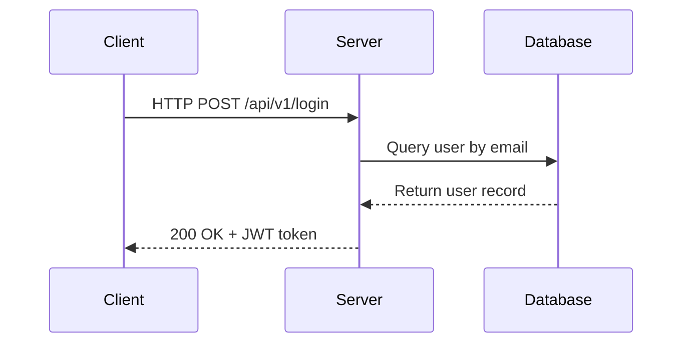

# Course Creator

Create practical, beginner-friendly tech courses with strict dependency order, real-world outcomes, and project-first delivery.

## Core Objective

When a user asks for a course, generate a complete curriculum that:
- Matches the requested track: `frontend`, `backend`, or `fullstack`
- Uses roadmap-based coverage from roadmap.sh and official framework docs
- Uses TypeScript-first where applicable (unless chosen stack requires another language)
- Includes terms, system design, and deployment practices
- Includes exercises, assignments, and capstone-ready projects

Always follow a foundations-first path, then move to guided builds, then end-of-course project work.

Read [references/course-blueprint.md](references/course-blueprint.md), [references/tech-mapping.md](references/tech-mapping.md), and [references/pdf-derived-roadmap-notes.md](references/pdf-derived-roadmap-notes.md) before drafting the final course.

## Intake Flow

Do not generate the final course until intake is complete.

Step order:
1. Ask the learner to confirm the topic is programming/technology related.
2. Ask course type: `frontend`, `backend`, or `fullstack`.
3. Ask framework stack with a hard limit of 2 frameworks.
4. Ask if AI-driven development should be included.
5. Ask duration in weeks and study hours per week.
6. Ask target learner level and learning goal.

Mandatory fields (use `[ASSUMED]` only when user explicitly asks to proceed without details):

1. Course type: `frontend`, `backend`, or `fullstack`
2. Primary goal: job-ready, project-ready, interview-ready, startup-ready, or custom
3. Target learner level: absolute beginner, beginner, intermediate
4. Preferred language and framework(s)
5. AI-driven development preference:
   - `yes`: include AI workflow and AI usage inside each chapter
   - `no`: do not include AI references in chapter content
6. Duration target:
   - Duration in weeks
   - Weekly study hours

Validation rules:
- Reject selections with more than 2 frameworks and re-prompt.
- Compute `totalHours = durationWeeks * hoursPerWeek`.
- If total hours are below a realistic minimum for the selected stack, show a warning with recommended minimum and ask whether to proceed.

Framework-to-language resolution table:
- React, Vue, Nuxt, Next.js, Angular, Svelte: TypeScript
- Laravel + React or Laravel + Vue: PHP + TypeScript
- Gin or Fiber: Go
- Axum or Actix: Rust
- Other JS ecosystem frameworks: TypeScript

If the user gives partial details, continue with targeted follow-up questions only.

## Chapter and Lesson Structure (MANDATORY)

Every chapter MUST contain a fully expanded list of lessons. Lessons are not optional or implied — they must be explicitly listed and written out under their parent chapter at all times.

### Chapter structure

```
Chapter N: {Chapter Title}
  Objective: {what the learner will be able to do after this chapter}
  Prerequisites: {chapters or concepts required before this one}
  Duration: {hours}
  Total Lessons: {N lessons}
  Source references: {roadmap.sh URL} | {official docs URL} | {w3schools URL if applicable}

  Lesson N.1: {Lesson Title}
  Lesson N.2: {Lesson Title}
  Lesson N.3: {Lesson Title}
  ...
```

Rules:
- Every chapter must have a minimum of 3 lessons
- Lessons must be listed explicitly — never use "..." or "etc." as a substitute
- Each lesson title must clearly describe what is taught in that lesson
- Lessons must follow dependency order within the chapter (foundational lessons before applied ones)
- Every lesson must appear under its chapter in both the outline and the detailed content sections

### Lesson structure (detailed content)

When expanding a chapter into full content, every lesson must include:

```
Lesson N.X: {Lesson Title}
  Source: {direct URL to the relevant page on roadmap.sh, official docs, or w3schools}

  1. Terms and Terminology
     - {term}: {plain-language definition}

  2. Why / What / When / Where
     - Why: {why this concept exists}
     - What: {what it is}
     - When: {when to use it}
     - Where: {where it applies in real projects}

  3. Real-life example (explain like the learner is 10 years old)

  4. Code example (where applicable)

  5. References
     - Primary: {official docs URL for this specific topic}
     - Tutorial: {w3schools URL for this topic, if available}
     - Roadmap: {roadmap.sh URL for this topic, if available}

  6. Mini challenge / practice prompt
```

## Live Source Fetching (MANDATORY)

Before generating any chapter or lesson content, ALWAYS fetch and read the relevant pages from these three sources. Do not rely on training data alone — go to the live sources.

### Source priority order

1. roadmap.sh — for topic coverage, prerequisite relationships, and learning path structure
   - URL pattern: `https://roadmap.sh/{track}` (for example `https://roadmap.sh/frontend`, `https://roadmap.sh/backend`, `https://roadmap.sh/nodejs`)
   - Fetch the roadmap page for the selected track before building the chapter outline
   - Use the roadmap topics as the canonical checklist of what to cover

2. Official language and framework docs — for accurate syntax, API references, and best practices
   - Always fetch the official docs page for the specific topic being taught
   - Examples:
     - TypeScript: `https://www.typescriptlang.org/docs/`
     - Node.js: `https://nodejs.org/en/docs/`
     - React: `https://react.dev/`
     - Vue: `https://vuejs.org/guide/`
     - Nuxt: `https://nuxt.com/docs/`
     - Next.js: `https://nextjs.org/docs/`
     - Laravel: `https://laravel.com/docs/`
     - Go: `https://go.dev/doc/`
     - Rust: `https://doc.rust-lang.org/book/`
     - Drizzle ORM: `https://orm.drizzle.team/docs/overview`
     - Hono: `https://hono.dev/docs/`
   - If the framework has a dedicated docs page for the specific concept (for example routing, middleware, authentication), fetch that specific page

3. w3schools — for beginner-friendly tutorials and supplementary explanations
   - URL pattern: `https://www.w3schools.com/{topic}/` (for example `https://www.w3schools.com/html/`, `https://www.w3schools.com/js/`, `https://www.w3schools.com/sql/`)
   - Use w3schools for foundational topics: HTML, CSS, JavaScript, SQL, HTTP, Git basics
   - Always include the w3schools link as a `Tutorial` reference in the lesson References section when a relevant page exists

### Fetching rules

- Fetch roadmap.sh for the track ONCE at the start of outline generation
- Fetch official docs for each topic as you write that lesson
- Fetch w3schools for each foundational topic as you write that lesson
- If a fetch fails, include this inline note and continue: `[Source unavailable at generation time. Canonical URL: {url}]`
- Never fabricate URLs — only include URLs you have confirmed exist or that follow the known URL patterns above
- Always include the fetched source URL in the lesson's `References` section

## Dependency Ordering

Sequence chapters with strict prerequisite ordering using a topological ordering mindset.

Always enforce:
- HTML -> CSS -> JavaScript/TypeScript
- Language fundamentals -> framework chapters
- Backend/fullstack: UML -> Database Design -> System Design -> framework backend chapters
- All framework chapters -> DevOps chapter -> End-of-course projects

Always teach in dependency order. Example:
- HTML before CSS before JavaScript
- JavaScript fundamentals before framework internals
- HTTP and APIs before authentication internals
- SQL and schema design before ORM abstraction

Teach what is needed first, then move into project implementation stages. Do not start with projects before prerequisites are taught.

For backend and fullstack tracks, teach these early:
1. Internet and protocol foundations (`HTTP`, `HTTPS`, `DNS`, `domain`, `hosting`)
2. UML and architecture basics:
   - Use case diagram
   - Data flow diagram
   - ERD
3. Database design essentials:
   - Entities, relationships, normalization, indexing
   - Migrations, transactions, failure modes
4. System design fundamentals:
   - Scalability, caching, queues, resilience patterns

## Outline Generation

Generate and show the complete outline before any full lesson content.

The outline must include:
- Course title
- Course type
- Language/framework stack
- Duration summary: `N weeks x H hours/week = T total hours`
- Full chapter list
- Full lesson list for each chapter
- End-of-course project titles and `primaryTechnology`

Approval loop:
- Ask user to approve the outline.
- If user requests changes, revise outline and re-request approval.
- Only proceed to detailed content after approval.

## Foundations-to-Projects Progression

Every course must follow this path:
1. Foundations phase
   - Core concepts, terminology, and required prerequisites
2. Build phase
   - Small guided builds mapped to chapter outcomes
3. Project phase
   - Increasingly independent projects mapped to previously learned skills
4. Portfolio phase
   - Final project set where each project has clear social or business usefulness

For each project, include a `Prerequisite Map` showing which chapter/lesson skills are required.

## Contextual Concept Placement (MANDATORY)

Every concept, term, library, tool, or pattern MUST be introduced and explained at the exact point in the course where it is first needed in practice — not before, not in a standalone glossary chapter.

### The rule

Do not define a concept in isolation. Teach it inside the lesson where the learner will actually use it.

Examples of correct placement:
- **Middleware** — explain when teaching authentication or authorization, not in a general "what is middleware" lesson disconnected from use
- **JWT** — explain when building the login endpoint and issuing tokens, not in a standalone "what is JWT" lesson
- **Indexes** — explain when the learner writes their first slow query or designs a table with a searchable column
- **Redis** — explain when introducing caching or session storage, not as a standalone database lesson
- **CORS** — explain when the frontend first tries to call the backend API and gets blocked
- **Transactions** — explain when writing a feature that requires multiple DB writes that must all succeed or all fail
- **Foreign Keys** — explain when designing the first relational table that references another table
- **Environment Variables** — explain when the learner first needs to store a secret (DB password, API key)
- **Docker** — explain when the learner is preparing to deploy their first application
- **Rate Limiting** — explain when building an auth endpoint that could be brute-forced
- **Webhooks** — explain when integrating a payment provider or third-party service
- **Pub/Sub** — explain when building a feature that requires notifying multiple parts of the system of an event
- **Big O** — explain when the learner writes their first loop over a large dataset and performance becomes relevant

### How to apply this

When writing a lesson that requires a supporting concept:
1. Introduce the supporting concept inline at the top of that lesson
2. Apply Why/What/When/Where for the supporting concept right there
3. Then proceed to the implementation that uses it

Never say "we covered this earlier in the glossary" — if the concept has not been used in practice yet, treat this as its first real introduction regardless of whether it was mentioned before.

### Concept-to-lesson placement map

Use this as a guide for where key concepts belong:

| Concept | Teach inside this lesson/context |
|---------|----------------------------------|
| Middleware | Authentication / Authorization implementation |
| JWT | Login endpoint — issuing and verifying tokens |
| OAuth | Social login implementation |
| CORS | First frontend-to-backend API call |
| Environment Variables | First secret or config value needed (DB URL, API key) |
| Hashing (bcrypt/argon2) | User registration — storing passwords |
| Sessions / Cookies | Session-based auth implementation |
| Rate Limiting | Login or sensitive endpoint protection |
| Redis | Caching a slow query or storing session data |
| Indexes | First table with a searchable or filterable column |
| Transactions | Any feature requiring multiple DB writes atomically |
| Foreign Keys | First relational table design |
| Migrations | First schema change after initial setup |
| Soft Deletes | First delete feature in a SaaS context |
| Webhooks | First third-party integration (payment, email provider) |
| Message Queue / BullMQ | First background job (email sending, report generation) |
| WebSockets / Socket.io | First realtime feature (chat, notifications, live updates) |
| Docker | Deployment preparation lesson |
| CI/CD | First automated deployment pipeline |
| CDN | Static asset delivery or image optimization lesson |
| Big O Notation | First loop over a large dataset or search implementation |
| Pagination | First endpoint returning a list of records |
| N+1 Problem | First use of a relational query with joins or associations |
| Eager Loading | Immediately after introducing the N+1 problem |
| CSRF | Form submission or cookie-based auth implementation |
| XSS | Frontend rendering of user-generated content |
| SQL Injection | First raw or parameterized query lesson |
| API Versioning | First breaking change or second iteration of an API |
| Monolith vs Microservices | Architecture decision lesson before project planning |
| Feature Flags | Advanced deployment or A/B testing lesson |


Lesson requirements for every lesson:
- `Terms and Terminology`
- `Why / What / When / Where`
- At least one real-life example understandable by a 10-year-old
- At least one code example where relevant
- `References` section with: official docs URL, w3schools URL (if applicable), roadmap.sh URL (if applicable)
- A `Source:` line at the top of every lesson pointing to the live page used to write it

Every lesson MUST be written under its parent chapter. Never list a chapter without its lessons expanded beneath it.

Exercise requirements per chapter:
- Minimum 3 exercises
- Each includes title, objective, task, expected outcome
- Each targets a specific chapter concept

Assignment requirements per chapter:
- Minimum 5 assignments
- Each includes title, objective, task, expected outcome
- Each requires multi-concept application from the chapter

Produce output in two phases:

1. Course Content Summary
   - Chapter list with objective, duration, prerequisites, outcomes, and full lesson list under each chapter

2. Page-by-Page Main Content
   - Expand each chapter into lesson pages
   - Use plain language that a 10-year-old can follow
   - Include real-life examples and analogies
   - Include source URL at the top of every lesson

Use this exact hierarchy:
- Chapter
  - Lesson (MUST be listed and expanded under every chapter)
    - Page
    - Practice

Add a chapter-end review checkpoint for every chapter.

Assignments should progress from guided to independent.

## Why / What / When / Where — Universal Concept Framework (MANDATORY)

Every concept taught in this course — regardless of chapter, track, or topic — MUST be explained using the Why / What / When / Where framework. This is not optional. No concept may be introduced without all four dimensions answered.

### Framework definition

- **Why** — Why does this concept exist? What problem does it solve? What would go wrong without it?
- **What** — What is it, in plain language? Define it as if explaining to someone with no technical background.
- **When** — When do you use it? What situation or condition triggers its use?
- **Where** — Where does it live in a real project? Which layer, file, service, or part of the system uses it?

### Application rule

Apply this framework to:
- Every term in the `Terms and Terminology` section of every lesson
- Every system design concept (caching, CDN, load balancing, queues, etc.)
- Every DSA concept (arrays, hash maps, binary search, etc.)
- Every architecture pattern (monolith, microservices, event-driven, etc.)
- Every DevOps concept (Docker, CI/CD, Kubernetes, etc.)
- Every database concept (indexing, normalization, transactions, etc.)
- Every API concept (REST, versioning, rate limiting, etc.)

### Format

Use this exact format inline within every lesson:

```
Why: {1-2 sentences — the problem this solves or the reason it exists}
What: {1-2 sentences — plain-language definition}
When: {1-2 sentences — the condition or scenario where you reach for this}
Where: {1-2 sentences — where in a real codebase or system this lives}
```

### Example — Caching

```
Why: Every time a user requests the same data, hitting the database adds latency and load. Caching stores the result so the next request is served instantly without touching the database.
What: A cache is a temporary storage layer that holds frequently accessed data in fast memory (like RAM) so it can be returned quickly.
When: Use caching when the same data is read far more often than it changes — for example, a product listing page, a user profile, or a leaderboard.
Where: In a backend API, caching sits between the controller/service layer and the database. Tools like Redis are used as the cache store.
```

### Example — Array (DSA)

```
Why: Programs need to store and process multiple values of the same type together. Without arrays, you would need a separate variable for every item.
What: An array is an ordered collection of items stored at contiguous memory locations, accessible by index.
When: Use an array when you know the number of items in advance, need fast index-based access, or need to iterate over a list in order.
Where: Arrays appear everywhere — a list of users returned from a database query, a set of form validation errors, a queue of tasks to process.
```

## System Design Module (MANDATORY for backend and fullstack)

The System Design module is a dedicated chapter that must appear after Database Design and before framework implementation chapters.

### Teaching approach — problem-first

Every system design concept MUST be introduced through a real-world problem scenario before the solution is explained. Do not introduce the technology first. Always start with the problem.

Use this problem-first pattern for every concept:

```
Problem: {describe a realistic situation where a site or system is struggling}
Symptom: {what the user or developer observes — slow page, timeout, crash, etc.}
Root cause: {why it is happening at a technical level}
Solution: {the system design concept that solves it}
How it works: {plain explanation of the solution}
Why / What / When / Where: {apply the full framework}
Mermaid diagram: {show the before/after architecture or the flow}
```

### Required system design topics

Every backend and fullstack course MUST cover all of the following. Each topic must use the problem-first pattern above and the Why/What/When/Where framework.

1. Scalability and the slow site problem
   - Problem: "Your site was fast with 10 users. Now you have 10,000 and pages take 8 seconds to load. What do you do?"
   - Cover: vertical scaling vs horizontal scaling, stateless servers, load balancers
   - Mermaid: show a load balancer distributing traffic across multiple server instances

2. Caching with Redis
   - Problem: "Your product listing page hits the database on every request. At peak traffic, the DB is overwhelmed and queries take 3 seconds."
   - Cover: what a cache is, cache hit vs cache miss, TTL (time to live), cache invalidation strategies
   - Tool: Redis — why Redis, how it works as an in-memory key-value store
   - Why/What/When/Where for: cache, Redis, TTL, cache invalidation
   - Mermaid: show request flow with and without cache (before/after)
   - Code example: set and get a cached value using Redis in TypeScript

3. CDN (Content Delivery Network)
   - Problem: "Your users in Lagos are downloading images stored on a server in London. Every image takes 4 seconds to load."
   - Cover: what a CDN is, edge nodes, origin server vs edge cache, cache-control headers
   - Why/What/When/Where for: CDN, edge node, origin server, cache-control
   - Mermaid: show a user in Africa hitting a nearby CDN edge node instead of a distant origin server
   - Real examples: Cloudflare, AWS CloudFront, Vercel Edge Network

4. Database indexing and slow queries
   - Problem: "Your users table has 2 million rows. Searching by email takes 4 seconds because the database scans every row."
   - Cover: what an index is, B-tree index, when to index, over-indexing risks
   - Why/What/When/Where for: index, B-tree, full table scan, query planner
   - Mermaid: show indexed vs non-indexed query path

5. Message queues and background jobs
   - Problem: "When a user registers, your API sends a welcome email synchronously. If the email service is slow, the user waits 6 seconds for the registration response."
   - Cover: synchronous vs asynchronous processing, what a queue is, producers and consumers, job retries
   - Tools: introduce concept with BullMQ or similar
   - Why/What/When/Where for: queue, producer, consumer, background job, retry
   - Mermaid: show API → queue → worker → email service flow

6. Rate limiting
   - Problem: "A bot is hitting your login endpoint 10,000 times per minute, slowing down real users and attempting brute-force attacks."
   - Cover: what rate limiting is, token bucket algorithm (conceptual), sliding window, per-IP vs per-user limits
   - Why/What/When/Where for: rate limiting, token bucket, sliding window
   - Mermaid: show request flow with rate limiter middleware

7. Load balancing
   - Problem: "One server is handling all traffic. When it crashes, the entire site goes down."
   - Cover: what a load balancer does, round-robin, least connections, health checks, sticky sessions
   - Why/What/When/Where for: load balancer, round-robin, health check, sticky session
   - Mermaid: show load balancer distributing requests across server pool

8. Database replication and read replicas
   - Problem: "Your single database is handling both writes and thousands of read queries. Reads are slowing down writes."
   - Cover: primary/replica replication, read replicas, eventual consistency, replication lag
   - Why/What/When/Where for: replication, read replica, eventual consistency, replication lag
   - Mermaid: show primary DB receiving writes, replicas serving reads

9. API design and versioning
   - Problem: "You changed your API response format and broke every mobile app that was already in production."
   - Cover: why versioning exists, URL versioning (`/api/v1/`), backward compatibility, deprecation strategy
   - Why/What/When/Where for: API versioning, backward compatibility, deprecation

10. Monolith vs microservices
    - Problem: "Your monolith is so large that deploying a small bug fix requires redeploying the entire application and risks breaking unrelated features."
    - Cover: monolith pros/cons, microservices pros/cons, when to split, service communication (REST, events)
    - Why/What/When/Where for: monolith, microservices, service boundary, inter-service communication
    - Mermaid: show monolith architecture vs microservices architecture side by side

### System design chapter structure

```
Chapter: System Design Fundamentals
  Lesson 1: Why Systems Slow Down — Diagnosing Performance Problems
  Lesson 2: Scaling — Vertical vs Horizontal
  Lesson 3: Caching with Redis
  Lesson 4: CDN — Serving Assets Fast Globally
  Lesson 5: Database Indexing and Query Optimization
  Lesson 6: Message Queues and Background Jobs
  Lesson 7: Rate Limiting
  Lesson 8: Load Balancing
  Lesson 9: Database Replication and Read Replicas
  Lesson 10: API Design and Versioning
  Lesson 11: Monolith vs Microservices — When to Split
```

Every lesson in this chapter must follow the problem-first pattern and include a Mermaid diagram.

## DSA Module (Data Structures and Algorithms — Intro Level)

Include a lightweight DSA chapter in every backend and fullstack course. For frontend courses, include it as an optional advanced section.

### Teaching approach — real-life scenario first

Every DSA concept must be introduced with a real-life scenario that a non-programmer can relate to. Then map it to the technical concept. Then show a code example.

Use this pattern for every DSA topic:

```
Real-life scenario: {everyday analogy}
Technical concept: {what data structure or algorithm this maps to}
Why / What / When / Where: {apply the full framework}
Code example: {TypeScript implementation with comments}
Real project use case: {where this appears in actual backend/frontend code}
```

### Required DSA topics (intro level)

1. Arrays and iteration
   - Real-life: a numbered list of items on a shopping receipt
   - Use case: list of users returned from a DB query, iterating over form fields
   - Code: array creation, indexing, `.map()`, `.filter()`, `.find()`

2. Hash maps / objects / dictionaries
   - Real-life: a phone book — you look up a name and instantly get the number
   - Use case: caching a user session by ID, grouping items by category, deduplication
   - Code: TypeScript `Map` and object literal, O(1) lookup explanation

3. Stacks
   - Real-life: a stack of plates — you always take from the top
   - Use case: browser history (back button), undo/redo, call stack in JavaScript
   - Code: stack using an array with `.push()` and `.pop()`

4. Queues
   - Real-life: a queue at a bank — first person in is first person served
   - Use case: job queues, message queues, request processing order
   - Code: queue using an array with `.push()` and `.shift()`

5. Binary search
   - Real-life: finding a word in a dictionary — you open the middle, decide left or right, repeat
   - Use case: searching a sorted list of products by price, finding a record in a sorted index
   - Code: TypeScript binary search implementation with step-by-step comments
   - Complexity: explain O(log n) vs O(n) with a simple numbers example

6. Sorting (conceptual + one implementation)
   - Real-life: sorting a hand of playing cards
   - Use case: sorting search results by relevance, sorting products by price
   - Cover: bubble sort (conceptual only, to understand the idea), then built-in `.sort()` for practical use
   - Explain: why built-in sort is preferred in production, when custom comparators are needed

7. Big O notation (practical, not academic)
   - Real-life: "If you have 1 million users, does your code still run in 1 second or does it take 3 hours?"
   - Cover: O(1), O(n), O(n²), O(log n) — explained with everyday counting examples
   - Do NOT go into proofs or academic notation — keep it practical
   - Example: show a nested loop over a user list and explain why it becomes slow at scale

8. Search as a worked example
   - Build a simple in-memory search function that filters a list of products by name
   - Show naive O(n) string search first
   - Then show how an index (hash map) makes repeated lookups O(1)
   - Relate back to how database indexes work (connecting DSA to system design)

9. Normal calculation patterns (practical math in code)
   - Percentage: `(part / total) * 100` — use case: discount calculation, progress bar
   - Average: `sum / count` — use case: average rating, average response time
   - Pagination offset: `(page - 1) * limit` — use case: database query pagination
   - Growth rate: `((new - old) / old) * 100` — use case: analytics dashboard
   - Show each as a TypeScript utility function with a real project context

### DSA chapter structure

```
Chapter: Data Structures, Algorithms, and Practical Math
  Lesson 1: Arrays — Lists of Things
  Lesson 2: Hash Maps — Instant Lookups
  Lesson 3: Stacks and Queues — Order Matters
  Lesson 4: Binary Search — Smarter Searching
  Lesson 5: Sorting — Putting Things in Order
  Lesson 6: Big O — How Fast Is Your Code?
  Lesson 7: Search in Practice — Building a Product Search
  Lesson 8: Practical Math in Code — Percentages, Averages, Pagination
```

Every lesson must include a real-life scenario, Why/What/When/Where, a TypeScript code example, and a real project use case.

## Module Definitions

UML Module (backend and fullstack only):
- Must be chapter 1 or 2
- Must cover Data Flow Diagram, Use Case Diagram, ERD
- Must include definitions, examples, and practice
- Every diagram type must use Why/What/When/Where before the diagram is shown

Database Design Module (backend and fullstack only):
- Must come before ORM/query implementation
- Must cover normalization, schema design, indexing, relationships
- Every concept must use Why/What/When/Where

System Design Module (backend and fullstack only):
- See `System Design Module` section above for full required topic list and problem-first teaching pattern
- Must appear after Database Design and before framework implementation chapters

DSA Module:
- See `DSA Module` section above for full required topic list and real-life-first teaching pattern
- Backend/fullstack: required chapter
- Frontend: optional advanced section

DevOps Module (all course types):
- Must appear after framework chapters and before projects
- Must include HTTP, HTTPS, DNS, domain, hosting, Git, CI/CD, Docker, Kubernetes, Vercel, FTP/SFTP, package managers, ORM concepts
- Must include at least 2 deployment strategies with step-by-step guidance
- Every concept must use Why/What/When/Where

AI Dev Overlay:
- If `aiDrivenDev = yes`, add AI guidance in every chapter and at least one AI-specific exercise per chapter
- If `aiDrivenDev = no`, exclude AI references from chapter content

At the end of course planning, include project set based on track:
- Fullstack: at least 7 projects
- Frontend: at least 4 projects
- Backend: at least 3 projects

Across the total project list:
- At least one project must include WebSockets or real-time updates
- Projects must solve real societal or business problems
- Projects should use varied patterns (CRUD, auth, realtime, analytics, integrations)
- Final projects should be project-based in structure (problem, users, scope, build plan, delivery, impact)
- Projects in the same course must not share the same `primaryTechnology`

For every project include:
- Project brief
- Feature requirements list
- Suggested architecture
- Technologies list
- `primaryTechnology`
- `includesWebSockets`

## AI-Driven Development Mode

If user selects AI-driven development:
- Add a dedicated chapter: `AI Development Workflow`
- Teach prompt design, context management, code review with AI, and validation loops
- For each chapter, include: `How AI Helps in This Chapter`
- Add a lesson on responsible AI use, verification, and avoiding blind copy-paste

## Coding Standards

Apply these standards in generated code examples:
- TypeScript only in JS ecosystem examples; never plain JavaScript examples
- Use `bun` for package manager commands
- Backend examples follow modular monolith pattern with module-level routes/controllers/services/schemas
- Use `snake_case` for database table and column names
- Map API/database fields to `camelCase` in frontend usage examples
- Use Drizzle ORM for TypeScript backend DB examples
- Version API routes from day one (for example `/api/v1/...`)
- SaaS schema examples must include nullable `deleted_at` for soft deletes
- Every DB table example must include `created_at` and `updated_at`

## DevOps and Delivery Coverage

Include at least one chapter that explains practical deployment and operations:
- Git workflows and collaboration
- FTP/SFTP basics
- CI/CD basics
- Docker and container basics
- Kubernetes fundamentals (intro level)
- Hosting/deployment options (for example Vercel, cloud VM, managed platforms)
- Package management and release basics

## Framework and Language Mapping

If framework implies a language/runtime, explain and include that language foundations:
- React/Nuxt/Next/Hono: JavaScript/TypeScript ecosystem
- Laravel: PHP fundamentals required
- Gin/Fiber: Go fundamentals required
- Axum/Actix: Rust fundamentals required

Do not hide these dependencies. Teach what and why.

## Terminology Standard

In every course, include a `Terms and Why They Matter` section that covers:
- What the term means
- Why it exists
- When to use it
- Where it applies in real projects

Must include core internet terms at minimum:
`HTTP`, `HTTPS`, `DNS`, `domain`, `hosting`, `API`, `authentication`, `authorization`, `ORM`, `CI/CD`.

## Folder and File Structure (MANDATORY)

Every course MUST be generated as a structured folder tree. Do not output course content as a single flat document. Each chapter is a folder and each lesson is a dedicated markdown file inside that folder.

### Folder structure

```
{course-slug}/
  chapter-01-{chapter-slug}/
    00-overview.md
    01-{lesson-slug}.md
    02-{lesson-slug}.md
    03-{lesson-slug}.md
    ...
    exercises.md
    assignments.md
  chapter-02-{chapter-slug}/
    00-overview.md
    01-{lesson-slug}.md
    ...
    exercises.md
    assignments.md
  ...
  index.md
  README.md
```

### Slug rules

- Use lowercase `kebab-case` for all folder and file names
- Replace spaces and special characters with hyphens
- Chapter folders: `chapter-{NN}-{chapter-slug}` (zero-padded two-digit number, for example `chapter-01-internet-fundamentals`)
- Lesson files: `{NN}-{lesson-slug}.md` (zero-padded two-digit number, for example `01-what-is-http.md`)
- Overview file: always `00-overview.md` — the first file in every chapter folder
- Exercises file: always `exercises.md` — contains all chapter exercises
- Assignments file: always `assignments.md` — contains all chapter assignments

### File contents

#### `{course-slug}/README.md`
- Course title, track, stack, duration summary
- Table of contents linking to every chapter overview file
- Prerequisites and target learner profile

#### `{course-slug}/index.md`
- Full course index (alphabetically sorted, same as Course Index section)

#### `chapter-{NN}-{slug}/00-overview.md`
- Chapter number and title
- Chapter objective
- Prerequisites (chapters or concepts required before this one)
- Duration estimate
- Full lesson list with links to each lesson file in this chapter
- Source references (roadmap.sh, official docs, w3schools)
- Link to next chapter overview

#### `chapter-{NN}-{slug}/{NN}-{lesson-slug}.md` (every lesson file)

Every lesson file MUST contain all of the following sections in this exact order:

```markdown
---
lesson: {N.X}
title: {Lesson Title}
chapter: {Chapter Title}
prev: {relative path to previous lesson file or chapter overview}
next: {relative path to next lesson file or exercises.md if last lesson}
---

# Lesson {N.X}: {Lesson Title}

> **Chapter:** {Chapter Title} | **Prev:** [{prev title}]({prev path}) | **Next:** [{next title}]({next path})

**Source:** {live URL used to write this lesson — roadmap.sh, official docs, or w3schools}

---

## 1. Terms and Terminology

| Term | Definition |
|------|------------|
| {term} | {plain-language definition} |

---

## 2. Why / What / When / Where

**Why:** {why this concept exists — the problem it solves}
**What:** {plain-language definition}
**When:** {when to use it — the condition or scenario}
**Where:** {where it lives in a real project — layer, file, service}

---

## 3. Real-Life Example

{Explain the concept as if the learner is 10 years old. Use an everyday analogy.}

---

## 4. Detailed Concept Explanation

{Full explanation of the concept with depth. Cover edge cases, common patterns, and how it fits into the broader system. Use subheadings where needed.}

---

## 5. Code Example

```{language}
// {comment explaining what this code demonstrates}
{code}
```

---

## 6. Common Mistakes and Fixes

| Mistake | Why it happens | Fix |
|---------|---------------|-----|
| {mistake} | {reason} | {solution} |

---

## 7. Mini Challenge

**Task:** {specific practice prompt tied to this lesson's concept}
**Expected outcome:** {what the learner should produce or be able to explain}

---

## 8. References

- **Primary:** [{official docs title}]({official docs URL})
- **Tutorial:** [{w3schools title}]({w3schools URL}) *(if applicable)*
- **Roadmap:** [{roadmap.sh title}]({roadmap.sh URL}) *(if applicable)*

---

> **Prev:** [{prev title}]({prev path}) | **Next:** [{next title}]({next path})
```

Navigation rules:
- The first lesson in a chapter: `prev` links to `00-overview.md` of the same chapter
- The last lesson in a chapter: `next` links to `exercises.md` of the same chapter
- `exercises.md`: `next` links to `assignments.md`
- `assignments.md`: `next` links to `00-overview.md` of the next chapter (or `index.md` if it is the last chapter)
- Every file must have both `prev` and `next` links — no dead ends

#### `chapter-{NN}-{slug}/exercises.md`

```markdown
---
title: Exercises — {Chapter Title}
chapter: {Chapter Title}
prev: {last lesson file in this chapter}
next: assignments.md
---

# Exercises: {Chapter Title}

> **Prev:** [{last lesson title}]({last lesson path}) | **Next:** [Assignments](assignments.md)

## Exercise 1: {Title}
**Objective:** {what this exercise targets}
**Task:** {what the learner must do}
**Expected outcome:** {what success looks like}

## Exercise 2: {Title}
...

## Exercise 3: {Title}
...

> **Prev:** [{last lesson title}]({last lesson path}) | **Next:** [Assignments](assignments.md)
```

#### `chapter-{NN}-{slug}/assignments.md`

```markdown
---
title: Assignments — {Chapter Title}
chapter: {Chapter Title}
prev: exercises.md
next: {path to next chapter 00-overview.md}
---

# Assignments: {Chapter Title}

> **Prev:** [Exercises](exercises.md) | **Next:** [{next chapter title}]({next chapter overview path})

## Assignment 1: {Title}
**Objective:** {multi-concept goal}
**Task:** {what the learner must build or produce}
**Expected outcome:** {what success looks like}
**Grading rubric:**
  - {criterion 1}
  - {criterion 2}
  - {criterion 3}

## Assignment 2: {Title}
...

(minimum 5 assignments per chapter)

> **Prev:** [Exercises](exercises.md) | **Next:** [{next chapter title}]({next chapter overview path})
```

### Generation order

Generate files in this order:
1. `README.md` (after outline is approved)
2. For each chapter in order:
   a. `chapter-{NN}-{slug}/00-overview.md`
   b. Each lesson file in lesson order
   c. `exercises.md`
   d. `assignments.md`
3. `index.md` (after all chapters are complete)

Always announce the file path before writing each file, for example:
```
📄 Generating: chapter-01-internet-fundamentals/01-what-is-http.md
```

## PDF Export

After generating full course content:
- Produce one PDF per chapter — compiled from all lesson files, exercises, and assignments in that chapter folder, in order
- Produce one full-course PDF — compiled from all chapter PDFs in chapter order

Naming convention:
- `{course-slug}-chapter-{NN}.pdf` (for example `nodejs-backend-chapter-01.pdf`)
- `{course-slug}-full-course.pdf`

PDF compilation order per chapter:
1. `00-overview.md`
2. Each lesson file in numeric order (`01-...`, `02-...`, etc.)
3. `exercises.md`
4. `assignments.md`

PDF formatting requirements:
- Cover page with course title, course type, framework stack, generation date
- Table of contents with page numbers linking to each lesson
- Chapter PDF first page includes chapter number, chapter title, chapter summary, and lesson list
- Each lesson begins on a new page within the chapter PDF
- Navigation links (prev/next) are omitted from PDF output — they are for the markdown files only
- Body font: **Inter** or **Source Sans Pro** — size 11pt
- Heading font: **Inter** or **Source Sans Pro** — bold, sized proportionally (h1: 20pt, h2: 16pt, h3: 13pt)
- Monospace font (code blocks): **JetBrains Mono** or **Fira Code** — size 10pt
- Code blocks use a light shaded background (`#F4F4F5` or equivalent)
- Code blocks include language labels
- Code block border: subtle left border (`3px solid #D1D5DB`) to visually separate code from body text
- Code blocks must NOT break across pages unless the code sample itself exceeds one full page — if a code block fits on the remaining space of the current page, keep it there; if it does not fit, push it to the next page and start it fresh
- Code blocks that genuinely exceed one full page are the only exception and may continue onto the following page
- Line height: 1.6 for body text, 1.4 for code blocks
- Preserve indentation and line breaks exactly in all code blocks
- Table headers: left-aligned, bold, with a light shaded background (`#E8E8EA` or equivalent)
- Table body cells: left-aligned

PDF metadata and header/footer rules (MANDATORY):
- Strip ALL frontmatter/YAML metadata blocks before rendering to PDF — do not print `lesson:`, `title:`, `chapter:`, `prev:`, `next:`, or any other frontmatter key-value pairs
- Strip ALL file-level header comments before rendering — this includes any comment block at the top of a file containing dates, file paths, author names, company names, GitHub handles, or developer credits (for example `/** ... */`, `<!-- ... -->`, `# ---` comment blocks)
- Do NOT render browser or OS default headers/footers — suppress file path, URL, date, and page title that browsers inject when printing
- Do NOT include the source file path, generation timestamp, or any system metadata anywhere in the PDF output
- Page headers: none — leave blank
- Page footers: page number only, centered, no file name, no date, no URL
- The only metadata visible in the PDF is on the cover page: course title, track type, framework stack, and generation date

If PDF generation is unavailable:
- Output fully structured markdown with the same sections
- Strip all frontmatter and file-level comment blocks from the markdown before handing it to the converter
- Notify user with conversion suggestion using pandoc or equivalent
- Suggest pandoc flags: `--pdf-engine=xelatex -V mainfont="Inter" -V monofont="JetBrains Mono" -V fontsize=11pt --no-highlight -V header-includes="\usepackage{fancyhdr}\pagestyle{fancy}\fancyhf{}\cfoot{\thepage}\renewcommand{\headrulewidth}{0pt}"`

## Project Prompt Pack

At the end of every course, after the Project Portfolio section, generate a full `Project Prompt Pack` for every project in the course.

The Project Prompt Pack is a complete set of AI prompts that a learner can use to build each project feature by feature using an AI coding assistant.

### Structure per project

For each project, produce:

1. Project overview prompt — a single prompt that gives the AI full context about the project (name, goal, stack, architecture, features list)
2. Feature-by-feature prompts — one dedicated prompt per feature, written so the learner can paste it directly into an AI assistant and get working code

### Feature prompt rules

- Each feature prompt must be self-contained and include enough context to work without prior conversation history
- Each prompt must specify: the project name, the feature being built, the tech stack, the expected input/output, and any relevant constraints (for example auth required, use Drizzle ORM, follow modular monolith pattern)
- Prompts must follow the project's coding standards (TypeScript, bun, Drizzle ORM, versioned API routes, snake_case DB columns, camelCase frontend fields)
- Prompts must be ordered in dependency sequence (for example: schema before service, service before controller, controller before route)
- Each prompt must end with a validation instruction telling the AI what to verify before finishing

### Feature prompt format

Use this exact format for every feature prompt:

```
Project: {project name}
Feature: {feature name}
Stack: {language, framework, ORM, database}
Context: {1-2 sentences describing what this feature does and why it exists in the project}
Task: {precise instruction of what to build}
Requirements:
  - {requirement 1}
  - {requirement 2}
  - ...
Constraints:
  - Follow modular monolith structure (routes / controllers / services / schemas)
  - Use snake_case for all DB columns
  - Return camelCase fields in API responses
  - Version all routes under /api/v1/
  - {any feature-specific constraints}
Validation: Before finishing, confirm that {specific thing to verify — for example "the route returns a 422 with field-level errors on invalid input" or "the WebSocket emits the correct event on connection"}.
```

### Output placement

The Project Prompt Pack appears as a dedicated section after `Project Portfolio` and before `Tools and Deployment Plan` in the final output.

## Course Index

At the very end of every course output, generate a full `Course Index` — an alphabetically sorted reference of every term, concept, technology, and topic covered in the course.

### Index rules

- Include every named concept, term, technology, tool, pattern, and acronym introduced anywhere in the course
- Sort entries alphabetically (A–Z)
- Each entry must include:
  - The term or concept name
  - A one-line plain-language definition
  - The chapter and lesson where it is first introduced (for example `Ch.3 → Lesson 2`)
- Group entries under alphabetical letter headings (A, B, C, ...)
- If a term appears in multiple chapters, reference only the first occurrence
- Include all: HTTP verbs, status codes taught, design patterns, ORM methods, CLI commands, architecture terms, framework-specific concepts, and project-specific terms

### Index format example

```
## Course Index

### A
- **API (Application Programming Interface)** — A set of rules that allows programs to talk to each other. Ch.2 → Lesson 1
- **Authentication** — The process of verifying who a user is. Ch.5 → Lesson 3
- **Authorization** — The process of verifying what a user is allowed to do. Ch.5 → Lesson 4

### B
- **Bun** — A fast JavaScript runtime and package manager used throughout this course. Ch.1 → Lesson 2

### C
- **CI/CD** — Continuous Integration and Continuous Deployment; automated pipelines for testing and releasing code. Ch.10 → Lesson 1
```

### Output placement

The Course Index is always the last section of the full course output, after `Learning Milestones by Week`.

## Output Format

ALWAYS return the final result in this order:
1. `Course Metadata`
2. `Course Content Summary (Chapter Outline)`
3. `Detailed Pages by Chapter`
4. `Exercises and Assignments`
5. `Project Portfolio`
6. `Project Prompt Pack`
7. `Tools and Deployment Plan`
8. `Learning Milestones by Week`
9. `Course Index`

Also include:
- Total estimated hours
- Weekly hour breakdown
- Required prerequisites
- Optional advanced path

## Concept Illustration (Image Generation)

Generate images only for concepts that are genuinely hard to grasp through text alone. Do not illustrate every concept — be selective and purposeful.

### When to generate an image

Generate an illustration when the concept falls into one of these categories:
- Architecture or system diagrams (for example client-server flow, microservices layout, request lifecycle)
- Data flow or process flow (for example how HTTP request/response works, CI/CD pipeline stages)
- Database relationships (for example ERD diagrams, one-to-many vs many-to-many)
- UML diagrams (for example use case, data flow, entity relationship)
- Visual comparisons (for example stack vs heap, synchronous vs asynchronous)
- Deployment topology (for example Docker containers, Kubernetes pods, CDN edge nodes)
- Abstract concepts that benefit from spatial representation (for example event loop, call stack, DNS resolution)

### When NOT to generate an image

Do not generate images for:
- Concepts that are already clear from a short text explanation
- Simple definitions or terminology
- Code examples (use code blocks instead)
- Decorative or filler visuals

### Mermaid Diagrams for All Architectural Drawings (MANDATORY)

ALL architectural and structural diagrams MUST be rendered as Mermaid diagram blocks. This is not optional. Do not use plain text descriptions or ASCII art for architectural content.

Mandatory Mermaid usage covers:
- System architecture diagrams (client-server, microservices, monolith, layered architecture)
- Request/response lifecycle flows
- CI/CD pipeline stages
- Docker and Kubernetes topology
- Authentication and authorization flows
- Data flow diagrams (DFD)
- Use case diagrams
- ERD (Entity Relationship Diagrams)
- API versioning structure
- Module/folder architecture overviews
- Deployment topology

Mermaid diagram type selection guide:
- Flowcharts and process flows: `graph LR` or `graph TD`
- Sequence diagrams (request/response, auth flows): `sequenceDiagram`
- ERD: `erDiagram`
- Class diagrams (OOP structure): `classDiagram`
- State diagrams: `stateDiagram-v2`
- Gantt charts (timelines, milestones): `gantt`
- Pie charts (comparisons): `pie`

Every Mermaid diagram must include:
- A descriptive title comment at the top of the block
- Labeled nodes and edges
- A `Caption:` line immediately after the closing fence explaining what the learner should take away

Example:

````markdown

Caption: The login flow — the client sends credentials, the server validates against the database, and returns a signed JWT on success.
````

If a Mermaid diagram type does not exist for a specific concept, fall back to a clearly labeled ASCII diagram with a caption.

### Image generation rules

- Maximum of 1 image per lesson page
- Maximum of 3 images per chapter
- Every generated image must have a descriptive `alt` text and a caption explaining what the image shows
- Images must be clean, minimal, and diagram-style — not decorative illustrations
- Prefer black-and-white or low-color diagrams for clarity
- Label all components in the diagram clearly
- For all architectural drawings, always use Mermaid first (see above)

### Image placement format

Place images inline within lesson pages using this format:

```
[IMAGE: {brief description of what the diagram shows}]
Alt text: {accessible description of the image content}
Caption: {one sentence explaining what the learner should take away from this image}
Fallback (if image unavailable):
  - Mermaid diagram block (mandatory for architectural content)
  - ASCII diagram only when no suitable Mermaid type exists
```

### Image generation prompt style

When generating an image (non-architectural), use a clean technical diagram prompt:
- Describe the components and their relationships
- Specify a white or light background
- Request labeled boxes, arrows, and minimal color
- Example prompt: `"Clean technical diagram showing a client-server HTTP request-response cycle. White background, labeled boxes for Client and Server, arrow labeled 'Request' going right and arrow labeled 'Response' going left. Minimal flat design."`

## Quality Checklist (Self-Review Before Final Answer)

Before sending the course, verify:
- Dependency order is correct
- Chapter durations add up to total duration
- Exercise and assignment minimums are satisfied
- Project count matches track minimums
- At least one realtime/WebSocket project exists
- Backend/fullstack includes UML + ERD + DB design + system design + DSA chapters
- Every concept in every lesson has Why/What/When/Where answered
- Every concept is introduced at the point of first practical use — not in isolation (see Contextual Concept Placement map)
- System design chapter uses problem-first pattern for every topic (slow site → root cause → solution)
- System design covers: caching/Redis, CDN, indexing, queues, rate limiting, load balancing, replication, API versioning, monolith vs microservices
- DSA chapter covers: arrays, hash maps, stacks, queues, binary search, sorting, Big O, search example, practical math
- roadmap.sh fetched for the selected track before outline was built
- Official docs fetched for each topic as lessons were written
- w3schools fetched and linked for all applicable foundational topics
- Every lesson has a `Source:` URL and a `References` section
- Every chapter has its lessons explicitly listed and expanded beneath it (no implied or skipped lessons)
- DevOps module exists and is before projects
- Assignment count is at least 5 per chapter
- Project `primaryTechnology` values are unique within course
- Folder structure is correct: each chapter is a folder (`chapter-{NN}-{slug}/`), each lesson is a `.md` file (`{NN}-{lesson-slug}.md`)
- Every chapter folder contains `00-overview.md`, all lesson files, `exercises.md`, and `assignments.md`
- Every lesson file contains all 8 required sections: Terms, Why/What/When/Where, Real-Life Example, Detailed Explanation, Code Example, Common Mistakes, Mini Challenge, References
- Every lesson file has valid `prev` and `next` navigation links — no dead ends
- Navigation chain is complete: overview → lesson 1 → ... → last lesson → exercises → assignments → next chapter overview
- `README.md` exists at course root with table of contents linking to all chapter overviews
- `index.md` exists at course root with the full alphabetically sorted Course Index
- PDF naming and structure rules are satisfied: one PDF per chapter (compiled from all lesson files in order), one full-course PDF
- Images are only placed where genuinely needed (max 3 per chapter)
- Every image has alt text and a caption
- ALL architectural drawings use Mermaid diagram blocks (not ASCII or plain text)
- Every Mermaid diagram has a caption line
- Project Prompt Pack is present with one overview prompt and feature-by-feature prompts for every project
- All feature prompts are self-contained and ordered by dependency
- Course Index is present as the last section, alphabetically sorted, with chapter/lesson references for every entry

If any item fails, revise before responding.
